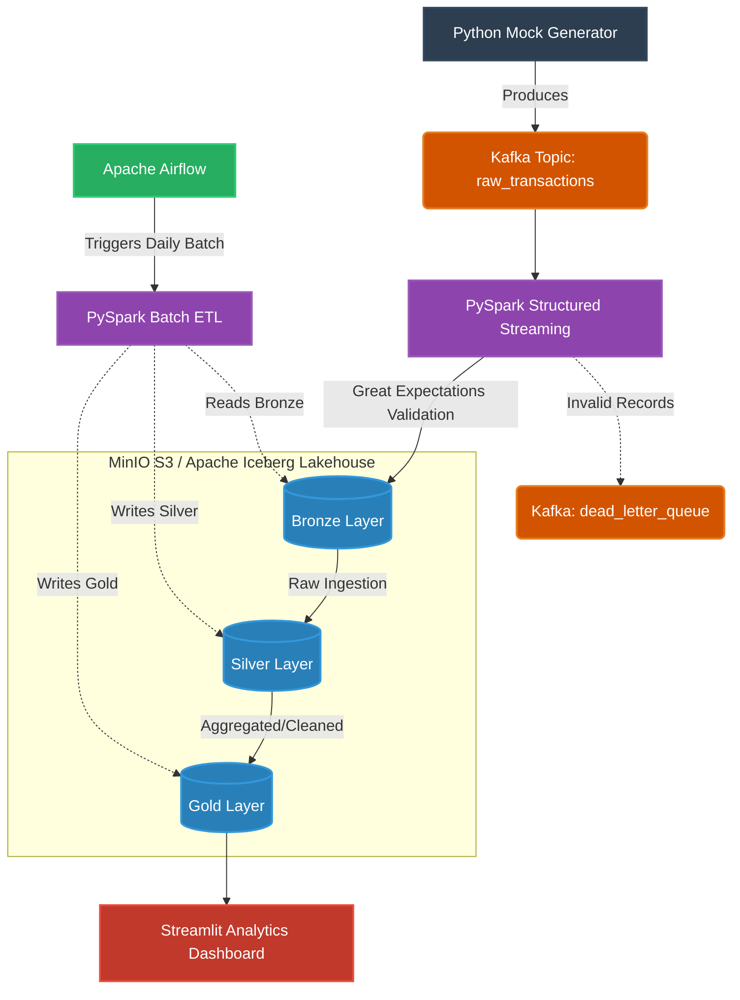

# Fintech Data Platform

A production-grade, end-to-end data engineering pipeline demonstrating real-time stream processing, batch ETL, and data orchestration utilizing the **Medallion Architecture**.

## Architecture Overview

This project simulates a real-time fintech payment system. Transactions are generated and processed through a robust data lakehouse architecture.



### Components
- **Data Generation:** Custom Python script generating synthetic JSON transaction data.
- **Message Broker:** Apache Kafka / Zookeeper for decoupled data ingestion.
- **Stream Processing:** PySpark Structured Streaming with Great Expectations for real-time data quality validation.
- **Lakehouse Storage:** MinIO (S3-compatible) serving as the storage layer using the Apache Iceberg table format.
- **Orchestration:** Apache Airflow automating batch PySpark jobs (Bronze -> Silver -> Gold).
- **Analytics:** Python Streamlit dashboard for real-time visualization of the Gold layer.

## Project Structure
```text
fintech-data-platform/
│
├── .github/workflows/       # CI/CD configurations
├── src/
│   ├── airflow/             # Airflow DAGs and custom Dockerfile
│   ├── analytics/           # Streamlit BI Dashboard
│   ├── batch/               # Batch ETL scripts (historical data)
│   ├── generator/           # Mock transaction generator
│   ├── lakehouse/           # PySpark Iceberg ETL jobs
│   └── streaming/           # Spark Structured Streaming pipeline
│
└── docker-compose.yml       # Infrastructure orchestration
```

## How to Run Locally

### 1. Start the Infrastructure
Make sure Docker Desktop is running. Start the entire data infrastructure (Kafka, MinIO, Airflow, Spark Streaming):
```bash
docker-compose up -d
```
*(Note: It may take 1-3 minutes for all containers to fully initialize, particularly Airflow).*

### 2. Access the UIs
- **MinIO Console (Storage):** `http://localhost:9001` (User: `minioadmin` / Pass: `minioadmin`)
- **Airflow Webserver (Orchestration):** `http://localhost:8080` (Check logs for the auto-generated standalone password).

### 3. Generate Data
In a new terminal, run the mock generator to start streaming data into Kafka:
```bash
cd src/generator
pip install -r requirements.txt
python generator.py
```

### 4. Run the Analytics Dashboard
Because running a BI tool in Docker uses excessive RAM, the analytics dashboard is built with Streamlit to be run natively on your machine:
```bash
cd src/analytics
pip install -r requirements.txt
streamlit run dashboard.py
```
This will open the dashboard in your browser at `http://localhost:8501`.
