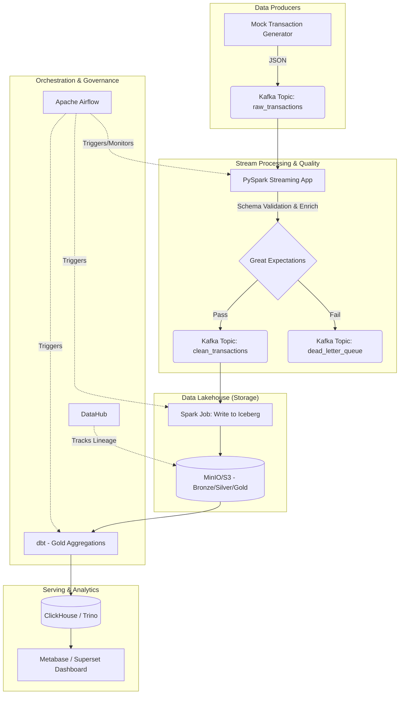
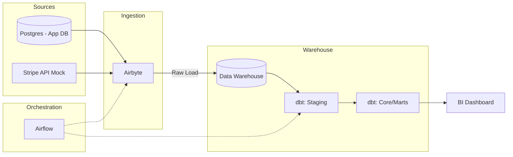

# Data Engineering Project Proposals & Roadmap

Welcome! As a senior data engineer mentor, I'm thrilled to guide you through building a production-grade, enterprise data engineering project. This will be an excellent portfolio piece.

## User Review Required

Please review the 3 enterprise-grade project proposals below. Let me know which one excites you the most, and we will proceed with that specific project. 

## 1. Three Enterprise-Grade Project Ideas

### Idea 1: Real-Time Fintech Fraud Detection & Analytics (Kappa Architecture)
**Concept**: A streaming data pipeline that ingests simulated credit card transactions, evaluates them for fraud in real-time, and stores the curated data in a Data Lakehouse for batch analytics and reporting.
**Tech Stack**: 
- **Ingestion**: Apache Kafka (or Redpanda)
- **Processing**: Apache Spark Streaming (PySpark) or Apache Flink
- **Storage**: Amazon S3 (MinIO locally) with Apache Iceberg or Delta Lake formats
- **Orchestration**: Apache Airflow or Dagster
- **Data Quality & Governance**: Great Expectations, DataHub (Metadata)
- **Analytics/Serving**: ClickHouse or Trino, Metabase for BI
**Why it's great**: It covers both streaming and batch, which is the holy grail of modern data engineering.

### Idea 2: Modern Data Stack (MDS) Customer 360 (ELT Pipeline)
**Concept**: An ELT (Extract, Load, Transform) pipeline extracting data from multiple sources (e.g., a mock Postgres transactional DB and a REST API), loading it into a Data Warehouse, and applying complex dimensional modeling.
**Tech Stack**:
- **Ingestion**: Airbyte (CDC - Change Data Capture)
- **Storage/Warehouse**: Snowflake or Postgres (acting as a DWH)
- **Transformation**: dbt (Data Build Tool)
- **Orchestration**: Apache Airflow
- **Data Quality & Governance**: dbt tests, Soda, OpenLineage
- **Analytics**: Apache Superset
**Why it's great**: This is exactly what 80% of companies are building right now. It's heavily focused on SQL, dbt, and cloud data warehousing.

### Idea 3: IoT Telemetry & Observability Data Platform
**Concept**: Ingesting high-throughput log/telemetry data from simulated IoT devices, processing it, and providing real-time observability dashboards.
**Tech Stack**:
- **Ingestion**: Vector or Fluentd, Kafka
- **Processing**: Python microservices, Spark
- **Storage**: Elasticsearch (OpenSearch) and S3
- **Orchestration**: Prefect or Airflow
- **Analytics**: Grafana / Kibana
**Why it's great**: Demonstrates handling high-velocity, semi-structured data and time-series analysis.

---

## 2. Best for Employability: Idea 1 (Real-Time Fintech Fraud Detection)

> [!TIP]
> **Why Idea 1 is the winner for your portfolio:**

1. **High Complexity Signal**: Streaming data (Kafka + Spark/Flink) demonstrates a deeper understanding of distributed systems compared to batch-only (cron + SQL).
2. **Lakehouse Architecture**: Using Apache Iceberg/Delta Lake is the current industry frontier. Companies are migrating away from expensive data warehouses to Lakehouses.
3. **Fintech Domain**: Fintech requires rigorous data quality, idempotency, and security. Showing you can handle this domain signals maturity.
4. **Comprehensive**: It touches every pillar: Ingestion, Streaming, Lakehouse Storage, Orchestration, Quality, and Serving.

---

## 3. Architecture Diagrams

### Architecture for Idea 1 (The Recommended Approach)

### Architecture for Idea 2 (ELT / Modern Data Stack)

---

## 4. Phased Roadmap (Assuming Idea 1)

We will build this iteratively, treating it like a real agile project.

### Phase 1: Infrastructure & Data Generation (The Foundation)
* **Goal**: Set up local infrastructure using Docker Compose and generate realistic fake data.
* **Tasks**:
    * Create a Git repository with proper structure.
    * Write `docker-compose.yml` for Kafka, Zookeeper, and MinIO.
    * Build a Python script using `Faker` to generate endless, realistic credit card transactions to a Kafka topic.
* **Mentorship Focus**: Idempotency, Docker networking, schema design.

### Phase 2: Ingestion & Stream Processing (The Core)
* **Goal**: Read from Kafka, clean the data, and enforce quality.
* **Tasks**:
    * Write a PySpark Structured Streaming application.
    * Implement basic transformations (timestamp parsing, currency conversion).
    * Integrate Great Expectations for inline data quality checks (drop bad rows, send to Dead Letter Queue).
* **Mentorship Focus**: Exactly-once processing semantics, checkpointing, handling late-arriving data.

### Phase 3: The Lakehouse (Storage & Batch)
* **Goal**: Land the processed data into an Apache Iceberg or Delta Lake table on MinIO.
* **Tasks**:
    * Configure Spark to write in Iceberg format.
    * Implement the Medallion architecture (Bronze -> Silver -> Gold).
    * Use `dbt` (or pure Spark SQL) to aggregate data into Gold tables (e.g., daily fraud rates, user spending profiles).
* **Mentorship Focus**: Partitioning strategies, file sizing (small file problem), ACID transactions on object storage.

### Phase 4: Orchestration & Governance
* **Goal**: Automate the pipeline and track metadata.
* **Tasks**:
    * Set up Apache Airflow via Docker.
    * Write DAGs to trigger the Spark batch jobs and monitor the streaming jobs.
    * Deploy DataHub to crawl the MinIO, Spark, and Kafka instances to generate a data lineage map.
* **Mentorship Focus**: DAG idempotency, backfilling, dependency management, metadata importance.

### Phase 5: Analytics & CI/CD (The Polish)
* **Goal**: Serve the data and ensure code quality.
* **Tasks**:
    * Connect a BI tool (Metabase/Superset) to the Gold layer (via Trino or directly to Spark/Iceberg).
    * Create a dashboard (e.g., "Live Fraud Alerts", "Daily Volume").
    * Add GitHub Actions for CI (linting Python code, running Pytest).
    * Write extensive `README.md` and documentation.
* **Mentorship Focus**: Dashboard performance, testing data pipelines, presentation skills for interviews.

---

## Open Questions

- Do you have a preference for any specific tools (e.g., Flink vs. Spark, Iceberg vs. Delta)?
- Are you comfortable using Docker for local infrastructure setup?

## Next Steps
1. Review the options.
2. Tell me which idea you choose.
3. Once approved, we will transition to execution mode, and begin Phase 1!
