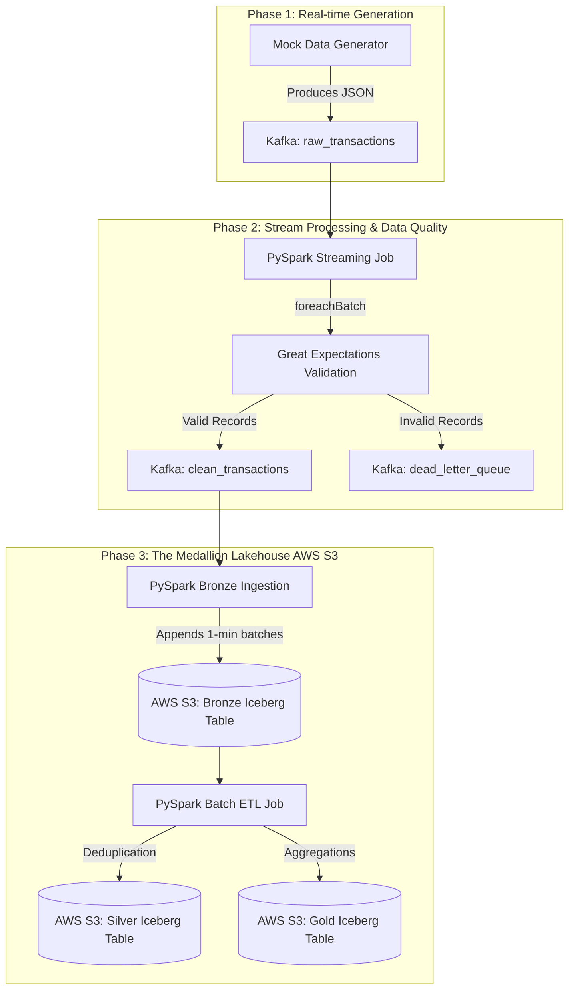

# Fintech Data Platform: End-to-End Lakehouse Architecture
**Project Documentation & Technical Walkthrough**

---

## 1. Project Overview
The **Fintech Data Platform** is a portfolio-ready, production-grade data engineering pipeline designed to process, validate, and store streaming financial transactions. The goal of this project is to build a robust architecture capable of handling real-time data ingestion while ensuring strict data quality constraints and providing a scalable analytics storage layer.

To achieve this, we implemented a **Medallion Architecture (Bronze, Silver, Gold)** using modern streaming and lakehouse technologies.

### **Core Tech Stack**
*   **Infrastructure:** Docker & Docker Compose
*   **Message Broker:** Apache Kafka & Zookeeper
*   **Stream Processing:** Apache Spark (PySpark Structured Streaming)
*   **Data Quality Validation:** Great Expectations (GX)
*   **Lakehouse Storage Format:** Apache Iceberg
*   **Cloud Object Storage:** AWS S3 (migrated from local MinIO)

---

## 2. Architecture & Data Flow
The pipeline is broken down into three distinct phases: Generation, Processing/Validation, and Lakehouse Storage.

### **Architecture Diagram**


### **Phase 1: Real-time Data Generation**
*   **Component:** `src/generator/generator.py`
*   **Description:** A Python-based mock data generator simulates real-time financial transactions (including user IDs, currencies, amounts, locations, etc.).
*   **Action:** It continuously pushes JSON payloads into the `raw_transactions` Kafka topic.

### **Phase 2: Stream Processing & Data Quality**
*   **Component:** `src/streaming/streaming_job.py`
*   **Description:** A PySpark Structured Streaming application subscribes to the `raw_transactions` topic.
*   **Action:** Instead of blindly storing data, it processes the stream in micro-batches using `foreachBatch`. During each micro-batch, it runs strict row-level validations using **Great Expectations**. 
*   **Routing:** 
    *   **Valid records** (e.g., amount > 0, currency in standard list) are routed to the `clean_transactions` Kafka topic.
    *   **Invalid records** are routed to a Dead Letter Queue (`dead_letter_queue` topic) for auditing.

### **Phase 3: The Medallion Lakehouse (Iceberg + AWS S3)**
We implemented a Bronze-Silver-Gold architecture using **Apache Iceberg**, allowing for ACID transactions on our data lake. The data is stored remotely in an **AWS S3 bucket** (`fintech-lakehouse-519570322329`).

#### **Bronze Layer (Raw, Validated Data)**
*   **Component:** `src/lakehouse/bronze_ingestion.py`
*   **Description:** A PySpark streaming job subscribes to the `clean_transactions` Kafka topic.
*   **Action:** It appends the JSON payloads directly into an Iceberg table (`local.bronze.transactions`) every 1 minute. The table is partitioned by currency for optimized downstream querying.

#### **Silver Layer (Deduplicated & Cleaned)**
*   **Component:** `src/lakehouse/silver_gold_etl.py` (Batch)
*   **Description:** A batch ETL job reads from the Bronze Iceberg table.
*   **Action:** It deduplicates records based on `transaction_id` and overwrites the Silver Iceberg table (`local.silver.transactions_clean`).

#### **Gold Layer (Business Aggregations)**
*   **Component:** `src/lakehouse/silver_gold_etl.py` (Batch)
*   **Description:** The same ETL job calculates business-level metrics from the Silver table.
*   **Action:** It calculates the total transaction volume and count per merchant category and saves it to the Gold Iceberg table (`local.gold.merchant_metrics`).

---

## 3. Key Technical Milestones Achieved

1.  **Dockerized Infrastructure:** Successfully networked Kafka, Spark, and MinIO locally to ensure the pipeline could run uniformly in isolated containers.
2.  **Great Expectations Integration:** Overcame the challenge of applying Python-native Great Expectations validations to distributed PySpark partitions using a custom micro-batch approach.
3.  **Migration to AWS S3:** Transitioned the Lakehouse storage from a local MinIO emulator to a production AWS S3 bucket.
4.  **Hadoop AWS S3A Troubleshooting:** Resolved deep PySpark dependency and EC2 metadata timeout issues by configuring `SimpleAWSCredentialsProvider` and dynamically managing `path.style.access` configurations.
5.  **Iceberg Catalog Initialization:** Successfully bootstrapped the Iceberg Hadoop Catalog directly within an AWS S3 bucket, fully integrating Parquet data files with Avro metadata files.

---

## 4. How to Run the Pipeline

Currently, the entire pipeline is running automatically in Docker containers:
1.  **Infrastructure:** `docker-compose up -d` starts Kafka and Zookeeper.
2.  **Data Generator:** Runs locally to stream data into `raw_transactions`.
3.  **Stream Processing (Phase 2):** `spark-streaming-job` container continuously validates data and writes to `clean_transactions`.
4.  **Bronze Ingestion (Phase 3):** `lakehouse-bronze` container continuously writes clean data to AWS S3 as an Iceberg table.
5.  **Silver & Gold ETL (Phase 3):** You can trigger the ETL batch script at any time by running:
    ```bash
    docker exec lakehouse-batch python silver_gold_etl.py
    ```

## 5. Next Steps
*   **Phase 4 (Orchestration):** Implement Apache Airflow to schedule and monitor the `silver_gold_etl.py` batch jobs instead of running them manually.
*   **Observability:** Implement DataHub for end-to-end data lineage tracking.
